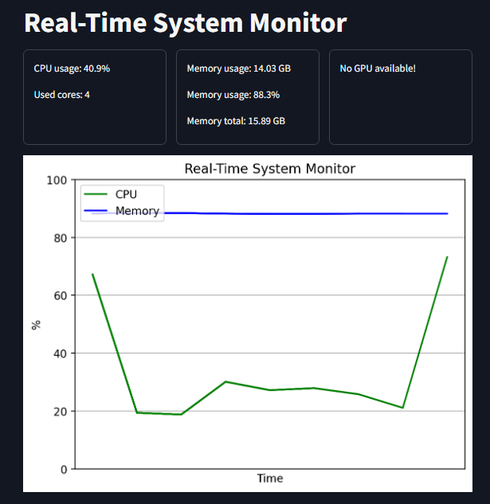

# System Resource Monitor

Real-time monitoring dashboard for CPU, RAM and GPU usage with live graphs.

## Features
- Live CPU usage and core count
- RAM usage and availability metrics
- GPU memory monitoring (if available)
- Real-time line graphs
- Configurable sampling rate

## Preview


## Technologies
- Python
- Streamlit
- psutil
- GPUtil
- Matplotlib

## Setup
1. Install requirements:
```bash
pip install streamlit psutil GPUtil matplotlib
