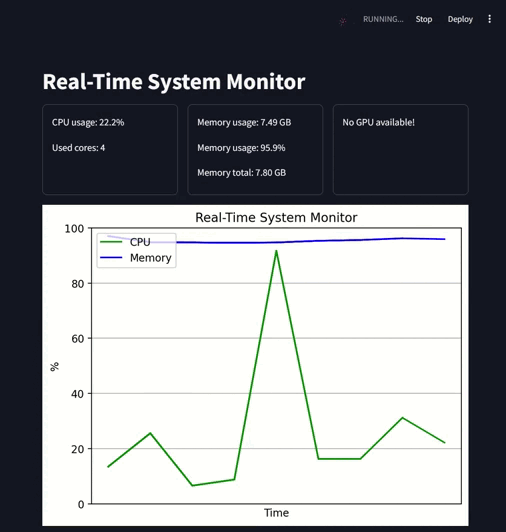

# System Resource Monitor

Real-time monitoring dashboard for CPU, RAM and GPU usage with live graphs.

## Technologies
 

 


## Preview


## Features
- Live CPU usage and core count
- RAM usage and availability metrics
- GPU memory monitoring (if available)
- Real-time line graphs
- Configurable sampling rate

## Setup
1. Install requirements:
```bash
pip install streamlit psutil GPUtil matplotlib
